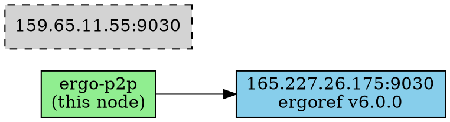

# ergo-p2p Tutorial

A comprehensive guide to using the ergo-p2p CLI tool for Ergo blockchain P2P networking.

## Table of Contents

- [Installation](#installation)
- [Quick Start](#quick-start)
- [CLI Reference](#cli-reference)
  - [Global Options](#global-options)
  - [Commands](#commands)
- [Interactive Explorer Guide](#interactive-explorer-guide)
- [Examples](#examples)
- [Troubleshooting](#troubleshooting)

---

## Installation

### Using Bundled Zig

```bash
git clone https://github.com/zutxo/ergo-p2p.git
cd ergo-p2p

# Download Zig 0.14.1 (one-time setup)
./zig/download.sh

# Build
./zig/zig build

# Run tests
./zig/zig build test
```

### Using System Zig

Requires Zig 0.14.0 or later:

```bash
zig build
```

The executable will be at `zig-out/bin/ergo-p2p`.

---

## Quick Start

```bash
# Start interactive explorer (default command)
./zig-out/bin/ergo-p2p

# Discover peers on mainnet
./zig-out/bin/ergo-p2p discover

# Monitor a specific peer
./zig-out/bin/ergo-p2p -p 213.239.193.208:9030 monitor
```

---

## CLI Reference

### Global Options

| Option | Short | Long | Description |
|--------|-------|------|-------------|
| Network | `-n` | `--network` | Select network: `mainnet` (default) or `testnet` |
| Peer | `-p` | `--peer` | Peer address in `host:port` format |
| Agent | `-a` | `--agent` | Custom agent name (default: `ergo-p2p`) |
| Help | `-h` | `--help` | Show help message |

**Help Output:**

```
ergo-p2p v0.1.0 - Ergo P2P Network Tool

USAGE:
    ergo-p2p [OPTIONS] [COMMAND]

COMMANDS:
    explore     Interactive network explorer (default)
    monitor     Monitor events from a single node
    discover    Discover peers from bootstrap nodes
    relay       Connect to multiple peers and monitor
    broadcast   Broadcast transaction to network

OPTIONS:
    -n, --network <NETWORK>  Network: mainnet (default), testnet
    -p, --peer <ADDR>        Peer address (host:port)
    -a, --agent <NAME>       Agent name (default: ergo-p2p)
    -t, --tx <HEX>           Transaction hex (for broadcast)
    -f, --file <PATH>        Transaction file (for broadcast)
    -s, --strategy <TYPE>    Broadcast strategy: all, staggered, random
    -c, --count <N>          Number of peers (default: 8)
    -h, --help               Show this help
```

---

### Commands

#### discover

Discovers peers on the Ergo network using bootstrap nodes.

**Usage:**
```bash
ergo-p2p discover                    # Mainnet discovery
ergo-p2p discover -n testnet         # Testnet discovery
ergo-p2p discover -p 1.2.3.4:9030    # Start from specific peer
```

**Example Output:**
```
ergo-p2p v0.1.0 - Peer Discovery
Network: mainnet

Loaded 8 bootstrap peers

Attempting to discover peers from 5 nodes...

Connecting to 165.227.26.175:9030... connected
  Peer: ergoref v6.0.0
  Requesting peers... discovered 4 new peers
Connecting to 159.65.11.55:9030... connected
  Peer: ergoref v5.0.20
  Requesting peers... discovered 4 new peers
Connecting to 159.89.116.15:9030... connected
  Peer: ergoref v6.0.1
  Requesting peers... discovered 4 new peers

Discovery Summary:
  Total known peers: 19
  Newly discovered:  12

Known Peers:
  [ 1] 159.89.116.15:9030 (ergoref v6.0.1) [seen]
  [ 2] 165.227.26.175:9030 (ergoref v6.0.0) [seen]
  [ 3] 159.65.11.55:9030 (ergoref v5.0.20) [seen]
  [ 4] 37.27.66.92:9030 (ergoref v5.0.24) [unknown]
  ...
```

**Peer States:**
- `[seen]` - Successfully connected in the past
- `[unknown]` - Discovered but not yet connected
- `[failed]` - Connection attempt failed
- `[connected]` - Currently connected
- `[banned]` - Peer banned for misbehavior

---

#### monitor

Monitors messages from a single peer in real-time.

**Usage:**
```bash
ergo-p2p -p <host:port> monitor
ergo-p2p -p 165.227.26.175:9030 monitor
ergo-p2p -p 213.239.193.208:9020 -n testnet monitor
```

**Example Output:**
```
ergo-p2p v0.1.0 - Monitor Mode
Network: mainnet
Connecting to: 165.227.26.175:9030

Connecting...
Connected!
Sending handshake...
Waiting for handshake response...

Peer Info:
  Agent: ergoref
  Name:  mainnet-seed-node-sf
  Version: 6.0.0
  Features: 2
  Address: 165.227.26.175:9030

Monitoring messages (Ctrl+C to quit)...

Sending SyncInfo...
Sending GetPeers request...
[2026-01-07 11:33:54] Peers: 4 peers
    [0] ergoref v6.0.0 (ergo-mainnet-6.0.0)
    [1] ergoref v5.0.20 (ergo-mainnet-5.0.20)
    [2] ergoref v6.0.1 (ergo-mainnet-6.0.1)
    [3] ergoref v6.0.0 (ergo-5.0.11-ca)
[2026-01-07 11:33:54] Inv: 400 Header(s)
    Requesting 3 header(s)...
[2026-01-07 11:33:54] SyncInfo: 1000 header ID(s)
```

**Messages Monitored:**
- `Peers` - Peer list responses
- `Inv` - Inventory announcements (headers, transactions)
- `SyncInfo` - Sync state information
- `ModifierResponse` - Block/transaction data
- `GetPeers` - Peer requests (from remote)

---

#### relay

Connects to multiple peers and aggregates messages from all of them.

**Usage:**
```bash
ergo-p2p relay                       # Connect to bootstrap peers
ergo-p2p relay -p 1.2.3.4:9030       # Start from specific peer
ergo-p2p relay -n testnet            # Testnet relay
```

**Example Output:**
```
ergo-p2p v0.1.0 - Multi-Peer Relay
Network: mainnet

Connecting to peers...

  Connecting to 165.227.26.175:9030... connected (ergoref v6.0.0)
  Connecting to 159.65.11.55:9030... connected (ergoref v5.0.20)
  Connecting to 159.89.116.15:9030... connected (ergoref v6.0.1)
  Connecting to 176.9.65.58:9030... connected (ergoref v6.0.0)

Connected to 4 peers

Monitoring messages from all peers...
[165.227.26.175:9030] Inv: 400 Header(s)
[159.65.11.55:9030] Peers: 5 peers
[159.89.116.15:9030] SyncInfo: 1000 header ID(s)
```

**Features:**
- Connects to up to 8 peers simultaneously
- Aggregates messages with source identification
- Performs peer discovery across all connections
- Shows connection summary on exit

---

#### explore

Interactive network explorer with REPL interface. This is the **default command** when no command is specified.

**Usage:**
```bash
ergo-p2p                             # Start explorer (default)
ergo-p2p explore                     # Explicit explorer
ergo-p2p explore -p 1.2.3.4:9030     # Start with peer connection
ergo-p2p explore -n testnet          # Testnet explorer
```

**Startup Banner:**
```
╔═══════════════════════════════════════════════════════════╗
║  ergo-p2p Interactive Explorer                            ║
║  Network: mainnet                                         ║
╚═══════════════════════════════════════════════════════════╝
```

See [Interactive Explorer Guide](#interactive-explorer-guide) for detailed command documentation.

---

#### broadcast

Broadcasts a transaction to the Ergo network.

> **Note:** This section provides specification only. Transaction broadcasting requires a valid signed transaction.

**Usage:**
```bash
ergo-p2p broadcast -t <hex>              # From hex string
ergo-p2p broadcast -f tx.hex             # From file
ergo-p2p broadcast -t <hex> -s staggered # With strategy
ergo-p2p broadcast -f tx.hex -c 5        # To 5 peers
```

**Options:**
| Option | Description |
|--------|-------------|
| `-t <hex>` | Transaction in hex format |
| `-f <file>` | Transaction file (hex or binary) |
| `-s <strategy>` | Broadcast strategy: `all`, `staggered`, `random` |
| `-c <count>` | Number of peers to broadcast to (default: 8) |

**Broadcast Strategies:**
- **all** - Send to all connected peers simultaneously
- **staggered** - Send with 100ms delay between peers (privacy-preserving)
- **random** - Send to random subset of peers

**Expected Output:**
```
ergo-p2p v0.1.0 - Transaction Broadcast
Network: mainnet

Transaction:
  ID:      abc123...def456
  Size:    342 bytes
  Inputs:  1
  Outputs: 2
  Value:   10.5 ERG

Connecting to peers...
  Connected to 5 peers

Broadcasting with strategy: all
  Broadcast result: 5/5 successful (100.0%)
  Modifier requests: 3

Waiting for propagation...
Done!
```

---

## Interactive Explorer Guide

The interactive explorer provides a REPL (Read-Eval-Print Loop) for network exploration.

### Command Reference

| Command | Shortcut | Syntax | Description |
|---------|----------|--------|-------------|
| connect | `c` | `connect <host:port>` | Connect to a peer |
| disconnect | `d` | `disconnect <id>` | Disconnect from peer |
| peers | `p` | `peers` | List connected peers |
| discover | - | `discover` | Request peers from all connections |
| mempool | `m` | `mempool [count]` | Show mempool transactions |
| headers | `h` | `headers [count]` | Show tracked headers |
| broadcast | `b` | `broadcast <hex>` | Broadcast transaction |
| stream | `s` | `stream [id] [on\|off]` | Toggle message streaming |
| status | - | `status` | Show explorer status |
| export | `e` | `export [filename]` | Export network graph (DOT) |
| verbose | `v` | `verbose` | Toggle verbose output |
| clear | - | `clear` | Clear screen |
| help | `?` | `help` | Show help |
| quit | `q` | `quit` or `exit` | Exit explorer |

### Connection Management

**Connect to a peer:**
```
ergo> connect 165.227.26.175:9030
Connecting to 165.227.26.175:9030... connected (ID: 1)
  Peer: ergoref v6.0.0
```

**List connected peers:**
```
ergo> peers
Connected Peers: (1 total)
  [1] 165.227.26.175:9030 (ergoref v6.0.0) msgs:5 [connected]

Known Peers: 8
```

**Disconnect:**
```
ergo> disconnect 1
Disconnected from peer 1
```

### Monitoring

**Check status:**
```
ergo> status
Explorer Status:
  Network:          mainnet
  Uptime:           5m 30s
  Connections:      2 connected, 15 known
  Messages:         127
  Mempool:          23 txs (156 total seen)
  Headers:          10 tracked (1200 total seen)
  Verbose:          off
```

**View mempool:**
```
ergo> mempool 5
Mempool: 23 transactions tracked

  [1] abc123...def456 (5s ago) - 2 peers
  [2] 789012...345678 (12s ago) - 1 peer
  [3] fedcba...987654 (30s ago) - 3 peers
  ...
```

**View headers:**
```
ergo> headers 5
Headers: 10 tracked

  [1] Height 1234567 abc123...def456 - 2 peers
  [2] Height 1234566 789012...345678 - 1 peer
  ...
```

**Toggle verbose output:**
```
ergo> verbose
Verbose mode: on
```

**Stream messages from a peer:**
```
ergo> stream 1 on
Streaming enabled for connection 1
```

### Network Analysis

**Discover more peers:**
```
ergo> discover
Requesting peers from 2 connections...
  Discovered 8 new peers
```

**Export network graph:**
```
ergo> export network.dot
Exported network graph to network.dot
View with: dot -Tpng network.dot -o network.png
```

**Generated DOT file:**


Convert to image:
```bash
dot -Tpng network.dot -o network.png
```

---

## Examples

### Peer Discovery Workflow

```bash
# 1. Discover peers on mainnet
./zig-out/bin/ergo-p2p discover

# 2. Connect to a discovered peer
./zig-out/bin/ergo-p2p -p 165.227.26.175:9030 monitor

# 3. Or use interactive explorer for more control
./zig-out/bin/ergo-p2p explore
ergo> connect 165.227.26.175:9030
ergo> discover
ergo> peers
ergo> export peers.dot
```

### Network Monitoring Session

```bash
./zig-out/bin/ergo-p2p explore

ergo> c 165.227.26.175:9030
ergo> c 159.65.11.55:9030
ergo> c 159.89.116.15:9030
ergo> status
ergo> stream 1 on
ergo> verbose
# Watch messages flow in...
ergo> mempool
ergo> headers
ergo> q
```

### Testnet Usage

```bash
# Discover testnet peers
./zig-out/bin/ergo-p2p discover -n testnet

# Monitor testnet node
./zig-out/bin/ergo-p2p -n testnet -p 213.239.193.208:9020 monitor

# Interactive testnet explorer
./zig-out/bin/ergo-p2p explore -n testnet
```

---

## Troubleshooting

### Connection Issues

**"WouldBlock" errors:**
- The peer is not responding within the timeout period
- Try a different peer from the bootstrap list
- Check your network connectivity

**"ConnectionRefused" errors:**
- The peer is not accepting connections
- The port may be blocked by firewall
- The node may be down

### No Messages Received

- Ensure you're connected to an active peer
- Use `status` to check connection state
- Enable verbose mode to see all activity
- Some peers may have limited activity

### Missing Transactions/Headers

- Transaction and header tracking starts when you connect
- Historical data is not retrieved automatically
- Connect to more peers to see more announcements

### Export Not Working

- Ensure you have write permissions to the directory
- Use absolute path if relative path fails
- Install Graphviz (`apt install graphviz`) to convert DOT files

---

## Protocol Reference

### Network Magic

| Network | Magic Bytes | Default Port |
|---------|-------------|--------------|
| Mainnet | `[1, 0, 2, 4]` | 9030 |
| Testnet | `[2, 0, 2, 3]` | 9020 |

### Message Types

| Code | Name | Description |
|------|------|-------------|
| 1 | GetPeers | Request peer list |
| 2 | Peers | Peer list response |
| 22 | ModifierRequest | Request block/tx data |
| 33 | ModifierResponse | Block/tx data response |
| 55 | Inv | Inventory announcement |
| 65 | SyncInfo | Sync state announcement |

### Modifier Types

| Code | Name |
|------|------|
| 2 | Transaction |
| 101 | Header |
| 102 | BlockTransactions |
| 104 | ADProofs |
| 108 | Extension |
